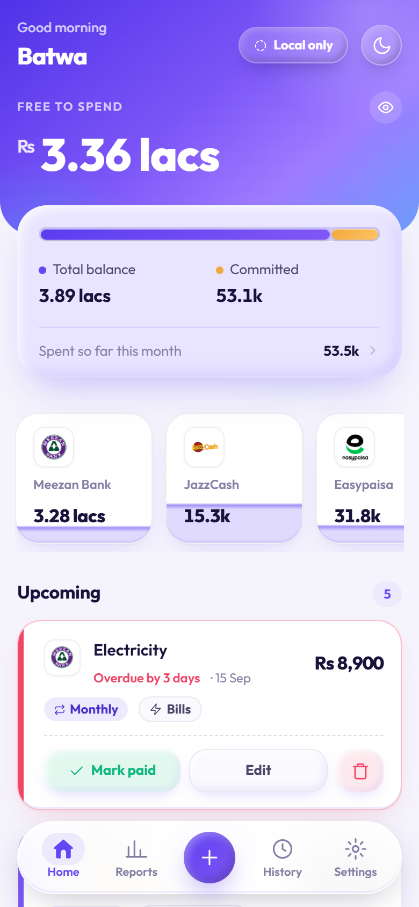
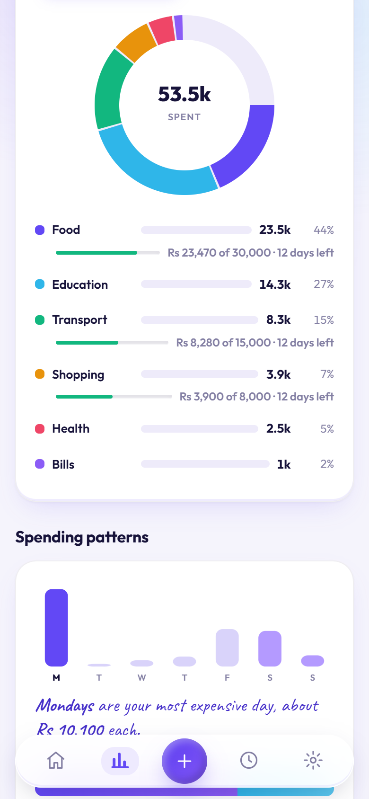
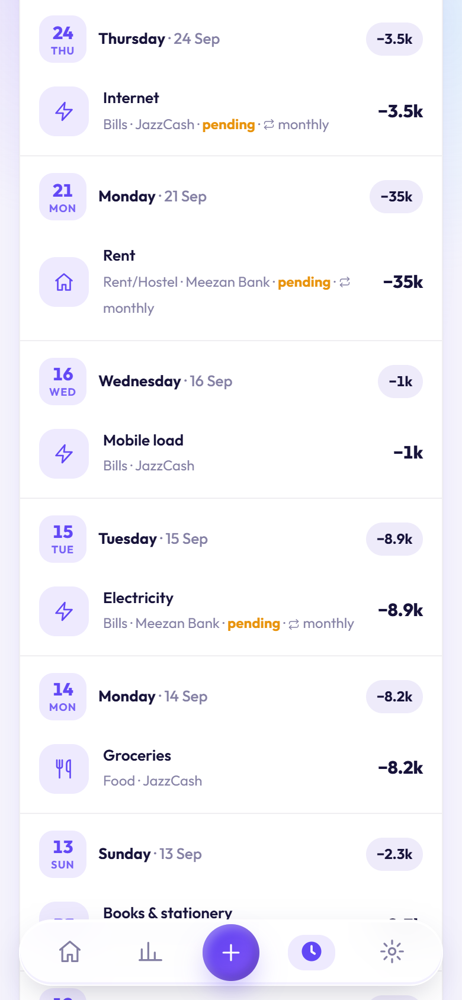

<p align="center">
  
</p>

<h1 align="center">Batwa — budgeting that never leaves your phone</h1>

<p align="center">
  A private, offline-first budget tracker you install from the browser.<br>
  PIN-locked, encrypted on the device, no account, no server, no tracking.
</p>

<p align="center">
  
  
  
  
</p>

<p align="center">
  
  
  
</p>

---

**Batwa** (Urdu for *wallet*) is a personal money tracker built for people who want to know where their salary goes without handing that information to anyone. It runs entirely inside your phone's browser as an installable app: you set a PIN, add your accounts (JazzCash, Easypaisa, banks, cash), log what comes in and goes out, and Batwa shows you what is actually free to spend after the bills that are already committed.

Everything is encrypted with a key derived from your PIN before it touches storage. There is no sign-up, no backend, and no analytics. Cloud sync is optional, and even then only the encrypted blob leaves the device.

## Features

- **Free to spend** at a glance: total balance minus committed bills, with a blur toggle for public places.
- **Accounts** with live balances, a logo picker for Pakistani wallets and banks, and a "fix balance" that keeps an honest audit trail.
- **Recurring bills** (weekly, monthly) with due dates, overdue tracking and one-tap mark-as-paid.
- **Reports**: spending by category or title, weekday and month-phase patterns, daily pace, a six-month trend, fixed vs one-off, and "worth watching" callouts.
- **Monthly category limits** that surface on Home and in Reports as you approach them.
- **Quick math** in the amount field: `120+80`, `1,500/3`, `(300+200)*2`.
- **Share a bank SMS** to Batwa on Android and the right sheet opens pre-filled.
- **Bill reminders** via background sync, storing only due dates and counts outside the encrypted ledger.
- **Fingerprint unlock** layered on top of the PIN using WebAuthn PRF. The PIN remains the only recovery path.
- **Optional cloud sync** through a JSONBin bin you own, with conflict prompts and never a silent overwrite.
- **Shared spaces** (optional): split expenses and settle up with family or friends through a zero-knowledge relay you host. Every member approves their own share and picks their own account. See [SETUP.md](SETUP.md).
- **Light and dark themes**, an installable home-screen icon, and full offline operation.

## Tech stack

| Layer | Choice | Why |
|---|---|---|
| Language | Vanilla JavaScript, native ES modules | Zero build step. Open the folder, serve it, it runs. |
| Styling | Plain CSS with design tokens (`css/tokens.css`) | One file defines colour, type, spacing, radius and depth for both themes. |
| Storage | IndexedDB | Large, structured, offline, per-origin. |
| Crypto | Web Crypto API: PBKDF2 (150k iterations) + AES-256-GCM | Standard primitives, no custom crypto. |
| Biometrics | WebAuthn with the PRF extension | The fingerprint unwraps the PIN-derived key. No PRF, no fallback, no weaker path. |
| Offline | Service Worker, precached shell, cache-first | Works with no network after the first load. |
| Integrations | Web Share Target, Periodic Background Sync, Notifications | Android SMS import and bill reminders. |
| Motion | GSAP 3 (vendored, self-hosted) | Smooth count-ups and sheet transitions offline. |
| Type | Outfit and Caveat (self-hosted variable fonts) | Outfit for UI, Caveat for tips and insights. |
| Sync (optional) | JSONBin REST API | Any static host plus a free bin you control. |
| Shared spaces (optional) | Cloudflare Worker + Durable Objects, Web Push (VAPID) | Stores only ciphertext keyed by random ids and forwards encrypted notifications. Code in [relay/](relay/). |

No framework, no bundler, no npm install, no runtime dependencies.

## Our motto: you own your data, we know nothing

Batwa is designed so that nobody, including the people who wrote it, can see your money.

- **Your PIN is the key, literally.** The four-digit PIN derives the encryption key. Nothing is stored that can rebuild it. Forget the PIN and the data is gone, which is why Settings offers an export backup and Home nudges you to take one.
- **Encrypted at rest, on your device.** The ledger lives in your browser's IndexedDB as AES-GCM ciphertext. The static host that serves the app files never receives a byte of it.
- **Nothing phones home.** No analytics, no crash reporting, no fonts or scripts fetched from third parties at runtime.
- **Sync is opt-in and blind.** If you enable JSONBin sync, only the encrypted blob is uploaded to a bin you created with your own key.
- **Reminders leak the minimum.** To notify you while the app is closed, only due dates and counts are kept outside the encrypted store. Never titles, never amounts.
- **Shared spaces are blind too.** A space is a random id, a write token and a key that live inside your encrypted ledger. The relay stores ciphertext and never learns names, amounts or who is in a space. Notification text is encrypted on the sender's phone.
- **Open source.** Every line that touches your data is in this repository for you to read.

## Shared spaces

Batwa can keep a joint ledger with the people you actually split money with, without a server that can read it.

- **One space per group.** Create a space, invite by QR or code in person, and each member picks a display name and colour. Nothing shared appears in the app until you hold at least one space.
- **Propose, approve, settle.** Anyone can add a shared expense with an equal or custom split. Each named member accepts it for themselves, choosing their own category and account, or rejects it with a reason. Settlements live in the transfer sheet under People, with a list of what you owe that person.
- **Sync without a database.** Every space is one encrypted document in a Cloudflare Worker. Phones merge per entry with revision counters, so three people editing offline still converge.
- **Notifications with context, still private.** "Faraz split Dinner · Rs 3,000" is encrypted with a per-space key before it leaves the sender's phone. Turn details off per space to get only "New activity".

Hosting the relay takes about 20 minutes on Cloudflare's free plan. The steps are in [SETUP.md](SETUP.md) and the relay's own README explains exactly what it can and cannot see.
## Getting started

### Use it

Deploy the folder to any static host and open the URL on your phone.

| Host | How |
|---|---|
| Netlify Drop | Drag the folder onto [app.netlify.com/drop](https://app.netlify.com/drop) |
| GitHub Pages | Push to a repo, then Settings, Pages, deploy from branch |
| Cloudflare Pages | Create a project, direct upload, drag the folder |
| Vercel | Run `npx vercel` inside the folder |

Then install it: on Android Chrome accept the install prompt or use *Add to Home screen*; on iPhone Safari use Share, then *Add to Home Screen*.

> Batwa cannot run from `file://`. Service workers need `https://` or `localhost`.

### Run it locally

```bash
git clone https://github.com/<you>/batwa.git
cd batwa
python -m http.server 8000     # or: npx serve
```

Open `http://localhost:8000`. That is the entire setup.

## Developer guide

### How the app boots

1. `index.html` paints the theme before first render using a tiny inline script, then loads `js/app.js` as a module.
2. `app.js` registers the service worker, mounts the lock screen from `js/auth.js`, and waits for a PIN (or a fingerprint via `js/biometric.js`).
3. The PIN derives the key in `js/crypto.js`. `js/db.js` reads the encrypted ledger from IndexedDB and `js/ledger.js` decrypts it into memory.
4. `app.js` renders the current view. Every ledger mutation fires an `onChange` that re-renders the active view, schedules a sync and refreshes the status pill.

### Where things live

```
index.html              app shell: header, view root, dock, sheet and toast roots
manifest.webmanifest    PWA manifest: icons, shortcuts, share target
sw.js                   service worker: precache list and cache version

css/
  tokens.css            design system: colours, type, spacing, radius, depth (light + dark)
  base.css              reset, layout primitives, focus and reduced-motion rules
  components.css        every component, grouped by section comments
  onboarding.css        first-run screens

js/
  app.js                boot, routing, navigation, update flow
  auth.js               PIN setup, verify, change; lock screen and onboarding
  biometric.js          WebAuthn PRF enrol and unlock
  session.js            keeps the app unlocked across a refresh, not across a close
  crypto.js             PBKDF2 key derivation, AES-GCM seal and open
  db.js                 IndexedDB wrapper
  ledger.js             entries, accounts, balances, recurrence, month queries
  insights.js           pure analysis functions used by Reports (Node-testable)
  sync.js               JSONBin push, pull and conflict handling
  relay.js              client for the shared-spaces relay
  spaces.js             shared spaces: bundles, sync loop, proposals, settlements, push
  spaces/               merge (pure), crypto (keys, invite codec), notify (encrypted summaries)
  reminders.js          due-date schedule and background notifications
  nudge.js              backup reminder banner
  smsparse.js           bank and wallet SMS parser for the share target
  theme.js              light, dark and system theme handling
  ui/                   one module per screen or widget: home, reports, history,
                        settings, accounts, modals (sheets), charts, icons, toast
  util/                 format (currency, dates), dom (helpers, animation), expr (quick math)
  vendor/gsap.min.js    animation library, self-hosted

fonts/                  Outfit and Caveat variable fonts
icons/                  favicon and PWA icon set, generated from branding/logo-source.png
screenshots/            store screenshots listed in the manifest (Chrome's rich install sheet)
branding/
  logo-source.png       master logo render; the one file to replace to rebrand
  logo.png              trimmed logo for the README and docs
  make-icons.py         regenerates every icon in icons/ from the source render
  banks/                bank and wallet logos for the account picker
```

### Conventions that keep the project simple

- **Bump the cache when you ship.** Change `CACHE` in `sw.js` (`batwa-v29` to `batwa-v30`) whenever a file changes, and add new files to its precache list. Users get a "New version ready" toast instead of a stale app.
- **Version the icon filenames when the logo changes.** Chrome decides an installed PWA needs re-packaging by diffing the manifest, so new artwork behind an old filename can sit stale on a phone for days. Bump `SUFFIX` in `branding/make-icons.py` and the references in `manifest.webmanifest`, `sw.js`, `index.html` and `js/auth.js`.
- **Colours and depth come from tokens.** Add or change a colour in `css/tokens.css` for both themes. Components should never hard-code a colour, except on surfaces that sit on the violet gradient in both themes.
- **Pure logic stays pure.** `insights.js`, `ledger.js` math, `smsparse.js` and `util/expr.js` have no DOM access, so you can test them directly with `node`.
- **One module owns one screen.** Each `ui/*.js` file renders its own markup and wires its own events. Cross-module UI goes through `modals.js` sheets.
- **No dependencies.** If a feature needs a library, vendor it into `js/vendor/` so the app keeps working offline and the supply chain stays auditable.
- **Privacy is a design constraint.** Anything stored outside the encrypted ledger must be justified in a code comment, as `reminders.js` does for due dates.

### Checking your work

```bash
# syntax check every module
for f in js/*.js js/ui/*.js js/util/*.js; do node --check "$f"; done

# exercise a pure module
node -e "import('./js/util/expr.js').then(m => console.log(m.evalAmountExpr('120+80')))"
```

For UI changes, serve the folder and test on a real phone or a 390 x 844 viewport in devtools, in both themes.

### Enabling cloud sync during development

1. Create a free bin at [jsonbin.io](https://jsonbin.io) with this starter content:
   ```json
   { "app": "batwa", "version": 1, "updatedAt": null, "salt": null, "cipher": null }
   ```
2. Copy the bin ID and your master key into Settings, Cloud sync, JSONBin setup.

Sync runs on open, a few seconds after each change, when connectivity returns and when the app returns to the foreground. The pill beside the greeting shows the live state and taps to sync now.

## Contributing

Issues and pull requests are welcome. Keep changes small and focused, follow the conventions above, bump the service worker cache, and include screenshots for anything visual. If a change touches storage or crypto, explain the privacy impact in the pull request.

## Acknowledgements

Built with the Web Platform and nothing else: IndexedDB, Web Crypto, WebAuthn, Service Workers, Web Share Target. Animations by [GSAP](https://gsap.com). Typefaces [Outfit](https://fonts.google.com/specimen/Outfit) and [Caveat](https://fonts.google.com/specimen/Caveat).
