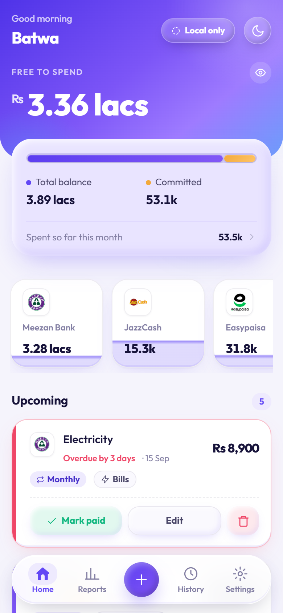
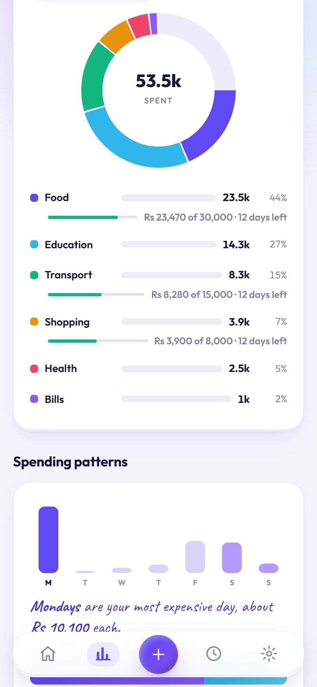
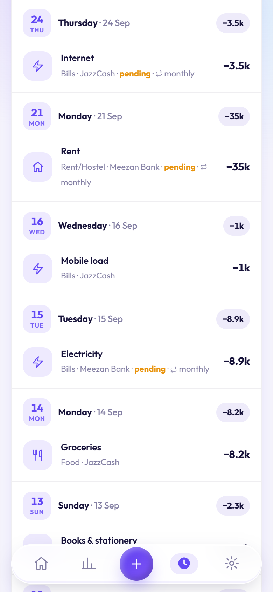

<p align="center">
  
</p>

<h1 align="center">Batwa — budgeting that never leaves your phone</h1>

<p align="center">
  A private, offline-first budget tracker you install from the browser.<br>
  PIN-locked, encrypted on the device, no account, no tracking.
</p>

<p align="center">
  Live app: <a href="https://batwa.zubyr.dev">https://batwa.zubyr.dev</a> &middot;
  About: <a href="https://batwa.zubyr.dev/about.html">https://batwa.zubyr.dev/about.html</a>
</p>

<p align="center">
  
  
  
  
</p>

<p align="center">
  
  
  
</p>

---

**Batwa** (Urdu for *wallet*) is a personal money tracker built for people who want to know where their salary goes without handing that information to anyone. It runs entirely inside your phone's browser as an installable app: you set a PIN, add your accounts (JazzCash, Easypaisa, banks, cash), log what comes in and goes out, and Batwa shows you what is actually free to spend after the bills that are already committed.

Everything is encrypted with a key derived from your PIN before it touches storage. There is no sign-up and no analytics. Nothing about your money ever leaves your phone unencrypted; the only ping Batwa sends on its own is one anonymous install count. Cloud sync is optional, and even then only the encrypted blob leaves the device.

## Features

- **Free to spend** at a glance: total balance minus committed bills, with a blur toggle for public places.
- **Accounts** with live balances, a logo picker for Pakistani wallets and banks, and a "fix balance" that keeps an honest audit trail.
- **Recurring bills** (weekly, monthly) with due dates, overdue tracking and one-tap mark-as-paid.
- **Reports**: spending by category or title, weekday and month-phase patterns, daily pace, a six-month trend, fixed vs one-off, and "worth watching" callouts.
- **Monthly category limits** that surface on Home and in Reports as you approach them.
- **Quick math** in the amount field: `120+80`, `1,500/3`, `(300+200)*2`.
- **Share a bank SMS** to Batwa on Android and the right sheet opens pre-filled.
- **Bill reminders** via background sync, storing only due dates and counts outside the encrypted ledger.
- **Fingerprint unlock** layered on top of the PIN using WebAuthn PRF. The PIN remains the only recovery path.
- **Optional cloud sync** through a JSONBin bin you own, with conflict prompts and never a silent overwrite.
- **Shared spaces** (optional): split expenses and settle up with family or friends through a zero-knowledge relay you host. Every member approves their own share and picks their own account. See [SETUP.md](SETUP.md).
- **Light and dark themes**, an installable home-screen icon, and full offline operation.

## Tech stack

| Layer | Choice | Why |
|---|---|---|
| Language | Vanilla JavaScript, native ES modules | No framework. The modules are plain browser JavaScript; `npm run dev` serves them as they are. |
| Build | [Vite](https://vite.dev) (dev-only dependency) | An instant dev server with hot reload. A production build with minified JS, split so Home loads only what it needs. Hashed filenames, so the service worker's precache list and cache name are generated and every update reliably reaches phones. Dev-only, so nothing extra ships to users. |
| Styling | Plain CSS with design tokens (`css/tokens.css`) | One file defines colour, type, spacing, radius and depth for both themes. |
| Storage | IndexedDB | Large, structured, offline, per-origin. |
| Crypto | Web Crypto API: PBKDF2 (150k iterations) + AES-256-GCM | Standard primitives, no custom crypto. |
| Biometrics | WebAuthn with the PRF extension | The fingerprint unwraps the PIN-derived key. No PRF, no fallback, no weaker path. |
| Offline | Service Worker, precached shell, cache-first | Works with no network after the first load. |
| Integrations | Web Share Target, Periodic Background Sync, Notifications | Android SMS import and bill reminders. |
| Motion | GSAP 3 (vendored, self-hosted) | Smooth count-ups and sheet transitions offline. |
| Type | Outfit and Caveat (self-hosted variable fonts) | Outfit for UI, Caveat for tips and insights. |
| Sync (optional) | JSONBin REST API | Any static host plus a free bin you control. |
| Shared spaces (optional) | Cloudflare Worker + Durable Objects, Web Push (VAPID) | Stores only ciphertext keyed by random ids and forwards encrypted notifications. Code in [relay/](relay/). |
| Install count | The same Worker, one `Stats` Durable Object | Three whole numbers (android, ios, other) and week-old random nonces. Shown live on the about page. |

No framework and no runtime dependencies. Vite is the only npm package, and it only runs at build time: nothing from npm ships to the phone except the bundled app code itself.

## Our motto: you own your data, we know nothing

Batwa is designed so that nobody, including the people who wrote it, can see your money.

- **Your PIN is the key, literally.** The four-digit PIN derives the encryption key. Nothing is stored that can rebuild it. Forget the PIN and the data is gone, which is why Settings offers an export backup and Home nudges you to take one.
- **Encrypted at rest, on your device.** The ledger lives in your browser's IndexedDB as AES-GCM ciphertext. The static host that serves the app files never receives a byte of it.
- **Nothing about you phones home.** No analytics, no crash reporting, no fonts or scripts fetched from third parties at runtime. The one ping is an install count: the first time Batwa runs as an installed app it sends the word `android`, `ios` or `other` and a random one-time nonce to the relay, once, ever. No ID, no user agent, no IP is stored, and the relay forgets the nonce after a week ([relay/src/stats.js](relay/src/stats.js)).
- **Sync is opt-in and blind.** If you enable JSONBin sync, only the encrypted blob is uploaded to a bin you created with your own key.
- **Reminders leak the minimum.** To notify you while the app is closed, only due dates and counts are kept outside the encrypted store. Never titles, never amounts.
- **Shared spaces are blind too.** A space is a random id, a write token and a key that live inside your encrypted ledger. The relay stores ciphertext and never learns names, amounts or who is in a space. Notification text is encrypted on the sender's phone.
- **Open source.** Every line that touches your data is in this repository for you to read.

## Shared spaces

Batwa can keep a joint ledger with the people you actually split money with, without a server that can read it.

- **One space per group.** Create a space, invite by QR or code in person, and each member picks a display name and colour. Nothing shared appears in the app until you hold at least one space.
- **Propose, approve, settle.** Anyone can add a shared expense with an equal or custom split. Each named member accepts it for themselves, choosing their own category and account, or rejects it with a reason. Settlements live in the transfer sheet under People, with a list of what you owe that person.
- **Only shared expenses create a debt.** A share counts as owed once it is accepted; until then it shows as waiting. Money sent to someone only pays down what you owe them, never past zero, so a plain transfer never makes anyone owe anyone. Balances are computed from the space on every read, so both phones always show the same numbers.
- **Sync without a database.** Every space is one encrypted document in a Cloudflare Worker. Phones merge per entry with revision counters, so three people editing offline still converge.
- **Notifications with context, still private.** "Faraz split Dinner · Rs 3,000" is encrypted with a per-space key before it leaves the sender's phone. Turn details off per space to get only "New activity".

Hosting the relay takes about 20 minutes on Cloudflare's free plan. The steps are in [SETUP.md](SETUP.md) and the relay's own README explains exactly what it can and cannot see.
## Getting started

### Use it

Build it once, then deploy the `dist/` folder to any static host and open the URL on your phone.

```bash
npm ci
npm run build        # writes dist/
```

| Host | How |
|---|---|
| Vercel | Import the repo or run `npx vercel`. `vercel.json` runs the build and serves `dist/` |
| Netlify Drop | Drag the `dist` folder onto [app.netlify.com/drop](https://app.netlify.com/drop) |
| Cloudflare Pages | Build command `npm run build`, output directory `dist` |
| GitHub Pages | Publish `dist/` with a Pages workflow (GitHub Actions) |

Only `dist/` is deployed. It holds the two pages, the service worker, the hashed bundles in `assets/` and everything in `public/`; the relay, tests and tools stay out of it.

Then install it: on Android Chrome accept the install prompt or use *Add to Home screen*; on iPhone Safari tap ••• (or Share), then *Add to Home Screen*. The app and the about page show an **Install app** button where the browser offers a prompt and a **How to install** guide everywhere else (`js/installguide.js`).

> Batwa cannot run from `file://`. Service workers need `https://` or `localhost`.

### Run it locally

Needs Node 20.19+ or 22.12+.

```bash
git clone https://github.com/zubairbinshaukat/batwa.git
cd batwa
npm install
npm run dev          # http://localhost:8000, source files as they are, live reload
npm run build        # production build in dist/
```

`npm run dev` never registers the service worker (it would cache source files). A worker left on `localhost:8000` by an earlier session (the old `python -m http.server 8000`, or a preview build) is replaced by a clean-up worker that clears its caches and reloads the page once, so your local data stays and the dev app takes over. Both commands use port 8000 and stop with an error if it is taken, rather than moving to another port (a different origin, without your local data). To try the real thing, offline mode and updates included, build and serve the output:

```bash
npm run build && npm run preview     # http://localhost:8000
```

## Developer guide

### How the app boots

1. `index.html` paints the theme before first render using a tiny inline script, then loads `js/app.js` as a module.
2. `app.js` registers the service worker (production builds only), mounts the lock screen from `js/auth.js`, and waits for a PIN (or a fingerprint via `js/biometric.js`).
3. The PIN derives the key in `js/crypto.js`. `js/db.js` reads the encrypted ledger from IndexedDB and `js/ledger.js` decrypts it into memory.
4. `app.js` renders the current view. Every ledger mutation fires an `onChange` that re-renders the active view, schedules a sync and refreshes the status pill.

### Where things live

```
index.html              app shell: header, view root, dock, sheet and toast roots
about.html              the marketing page (its own entry in the build)
sw.js                   service worker; the build fills in its cache name and precache list
package.json            Vite (dev only) and the dev, build, preview and test scripts
vite.config.js          the build: two pages, relative URLs, dist/ as output
vercel.json             build command, output folder and cache headers for Vercel
build/
  vite-plugin-sw.js     writes dist/sw.js: CACHE, SHELL and the about-page no-cache list

css/
  tokens.css            design system: colours, type, spacing, radius, depth (light + dark)
  base.css              reset, layout primitives, focus and reduced-motion rules
  components.css        every component, grouped by section comments
  onboarding.css        first-run screens
  about-page.css        about.html's only stylesheet (light only, never loaded by the app)

js/
  app.js                boot, routing, navigation, update flow
  auth.js               PIN setup, verify, change; lock screen and onboarding
  biometric.js          WebAuthn PRF enrol and unlock
  session.js            keeps the app unlocked across a refresh, not across a close
  crypto.js             PBKDF2 key derivation, AES-GCM seal and open
  db.js                 IndexedDB wrapper
  ledger.js             entries, accounts, balances, recurrence, month queries
  insights.js           pure analysis functions used by Reports (Node-testable)
  sync.js               JSONBin push, pull and conflict handling
  relay.js              client for the shared-spaces relay
  spaces.js             shared spaces: bundles, sync loop, proposals, settlements, push
  spaces/               merge (pure: merging, who-owes-whom, compaction), crypto (keys,
                        invite codec), notify (encrypted summaries)
  installguide.js       install button + guide sheet for every browser (app and about page)
  installcount.js       the one anonymous install ping
  reminders.js          due-date schedule and background notifications
  nudge.js              backup reminder banner
  smsparse.js           bank and wallet SMS parser for the share target
  theme.js              light, dark and system theme handling
  ui/                   one module per screen or widget: home, reports, history,
                        settings, accounts, sheet (the sheet layer), modals (the add/edit
                        forms), charts, icons, toast; lazy.js loads everything Home
                        doesn't need on demand
  util/                 format (currency, dates), dom (helpers, animation), expr (quick math)
  vendor/qrcode.js      QR encoder, an ES module the app imports (bundled)

public/                 served as-is, never bundled or hashed, under the same URLs as before
  manifest.webmanifest  PWA manifest: icons, shortcuts, share target
  css/installguide.css  the "How to install" sheet, shared with about.html (loaded there
                        without blocking, so it stays a separate file)
  js/vendor/            gsap.min.js (animation) and exceljs.min.js (Excel export), classic
                        scripts loaded by path, self-hosted
  fonts/                Outfit, Caveat and Fraunces variable fonts
  icons/                favicon and PWA icon set, generated from branding/logo-source.png
  screenshots/          store screenshots listed in the manifest (Chrome's rich install sheet),
                        and the about page's AVIF/WebP images (regenerate with tools/)
  branding/banks/       bank and wallet logos for the account picker
  favicon.ico, robots.txt, sitemap.xml, llms.txt, humans.txt
tools/
  make-images.mjs       dev-only: AVIF + WebP sets for the about page (cd tools && npm i && npm run images)
branding/
  logo-source.png       master logo render; the one file to replace to rebrand
  logo.png              trimmed logo for the README and docs
  make-icons.py         regenerates every icon in public/icons/ from the source render
```

### Conventions that keep the project simple

- **The cache bumps itself.** `npm run build` names the service worker cache `batwa-v<APP_VERSION>-<hash>`, the hash covering every file in `dist/` the worker may cache (the precache and everything it caches on first use, such as bank logos and icons), and lists every bundle the app can load, so any shipped change reaches phones as a "New version ready" toast. For a release, bump `APP_VERSION` in `js/config.js` and `softwareVersion` in the JSON-LD of `index.html` and `about.html`. A new file in `public/` that must work offline goes into `SHELL` in `sw.js`.
- **Version the icon filenames when the logo changes.** Chrome decides an installed PWA needs re-packaging by diffing the manifest, so new artwork behind an old filename can sit stale on a phone for days. Bump `SUFFIX` in `branding/make-icons.py` and the references in `public/manifest.webmanifest`, `sw.js`, `index.html` and `js/auth.js`.
- **Colours and depth come from tokens.** Add or change a colour in `css/tokens.css` for both themes. Components should never hard-code a colour, except on surfaces that sit on the violet gradient in both themes.
- **Pure logic stays pure.** `insights.js`, `ledger.js` math, `smsparse.js` and `util/expr.js` have no DOM access, so you can test them directly with `node`.
- **One module owns one screen.** Each `ui/*.js` file renders its own markup and wires its own events. Cross-module UI goes through sheets: `sheet.js` for the sheet layer (open, close, confirm, choose), `modals.js` for the add/edit forms.
- **Home loads only what Home needs.** Reports, History, Settings, the space view, the forms and the spaces sheets are loaded through `js/ui/lazy.js` (`load.reports()`, `use("modals", …)`) and prefetched right after Home paints; the service worker precaches them all. Don't import one of them statically from the start-up path: the build warns (`INEFFECTIVE_DYNAMIC_IMPORT`) when that folds it back into the main bundle.
- **No runtime dependencies.** If a feature needs a library, vendor it so the app keeps working offline and the supply chain stays auditable: an ES module the app imports goes in `js/vendor/` (bundled), a classic script loaded by path goes in `public/js/vendor/`.
- **Privacy is a design constraint.** Anything stored outside the encrypted ledger must be justified in a code comment, as `reminders.js` does for due dates.

### Checking your work

```bash
# unit tests: the owe rules and compaction (js/spaces/merge.js), crypto, report export
npm test

# the production build: fails if a precached file is missing from dist/
npm run build

# syntax check every module
for f in js/*.js js/ui/*.js js/util/*.js; do node --check "$f"; done

# exercise a pure module
node -e "import('./js/util/expr.js').then(m => console.log(m.evalAmountExpr('120+80')))"

# the relay, end to end against a local wrangler dev
cd relay && npm ci && npm test
```

For UI changes, run `npm run dev` and test on a real phone or a 390 x 844 viewport in devtools, in both themes. For anything touching offline or updates, use `npm run build && npm run preview`.

### Enabling cloud sync during development

1. Create a free bin at [jsonbin.io](https://jsonbin.io) with this starter content:
   ```json
   { "app": "batwa", "version": 1, "updatedAt": null, "salt": null, "cipher": null }
   ```
2. Copy the bin ID and your master key into Settings, Cloud sync, JSONBin setup.

Sync runs on open, a few seconds after each change, when connectivity returns and when the app returns to the foreground. The pill beside the greeting shows the live state and taps to sync now.

## Contributing

Issues and pull requests are welcome. Keep changes small and focused, follow the conventions above, run `npm test` and `npm run build`, and include screenshots for anything visual. If a change touches storage or crypto, explain the privacy impact in the pull request.

## Acknowledgements

Runs on the Web Platform and nothing else: IndexedDB, Web Crypto, WebAuthn, Service Workers, Web Share Target. Bundled with [Vite](https://vite.dev). Animations by [GSAP](https://gsap.com). Typefaces [Outfit](https://fonts.google.com/specimen/Outfit), [Caveat](https://fonts.google.com/specimen/Caveat) and [Fraunces](https://fonts.google.com/specimen/Fraunces).

## License

Batwa is MIT licensed. See [LICENSE](LICENSE).
